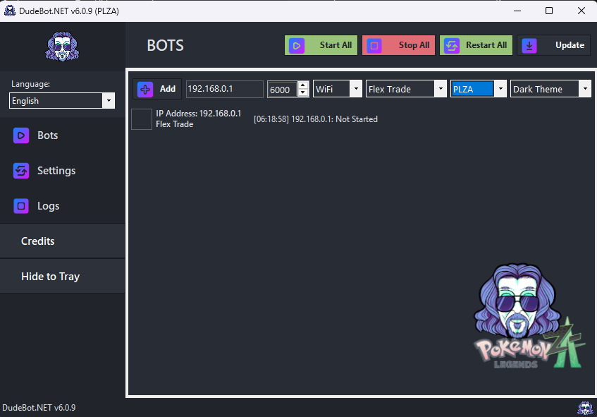
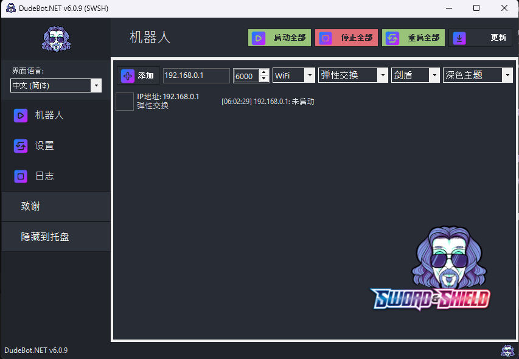
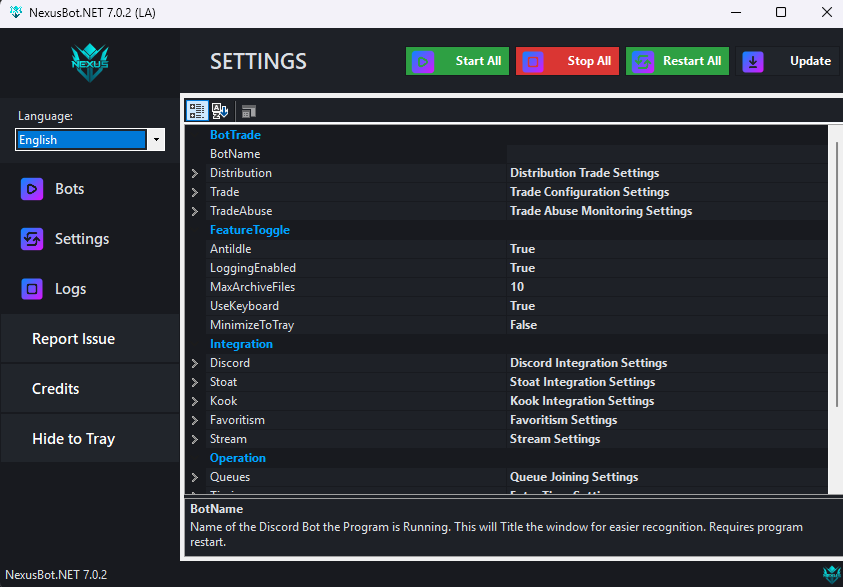
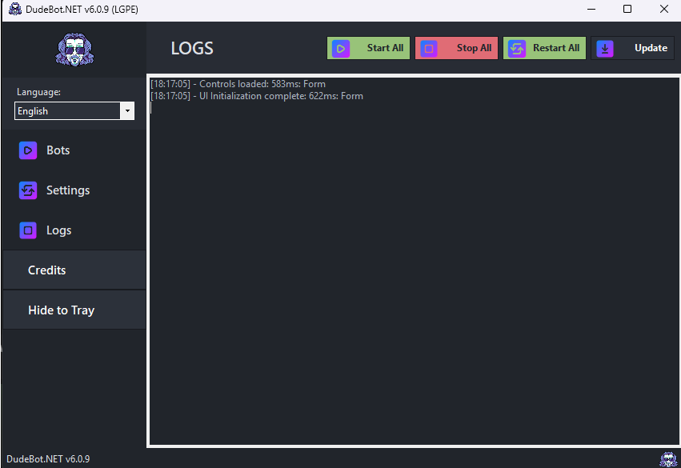
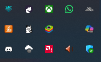

# 🤖 DudeBot.NET

**DudeBot.NET** is a high-performance, feature-rich fork of SysBot.NET, designed for advanced remote control automation of Nintendo Switch Pokémon games. Developed and maintained by **Nexus Risen**, it provides a robust framework for automated distribution, encounter hunting, and collection management.

---

## 📑 Table of Contents
- [🌟 Key Features](#-key-features)
- [📸 Screenshots](#-screenshots)
- [🏗️ Project Structure](#️-project-structure)
- [📦 Dependencies](#-dependencies)
- [👨‍💻 Development](#-development)
- [👥 Contributors](CONTRIBUTORS)
- [🤝 Support](#-support)
- [📜 License](#-license)

---

## 👥 Contributors

Thanks to these wonderful people:

<!-- ALL-CONTRIBUTORS-LIST:START - Do not remove or modify this section -->
<table>
  <tr>
    <td align="center"><a href="https://github.com/kwsch"> <b>kwsch</b></a> <a href="#code" title="Code">💻</a> <a href="#maintenance" title="Maintenance">🚧</a></td>
    <td align="center"><a href="https://nexusrisen.net"> <b>Nexus Risen</b></a> <a href="#code" title="Code">💻</a> <a href="#design" title="Design">🎨</a> <a href="#maintenance" title="Maintenance">🚧</a></td>
    <td align="center"><a href="https://github.com/Lusamine"> <b>Lusamine</b></a> <a href="#research" title="Research">🔬</a> <a href="#data" title="Data">📊</a></td>
    <td align="center"><a href="https://github.com/hexbyt3"> <b>Hexbyt3</b></a> <a href="#code" title="Code">💻</a></td>
  </tr>
  <tr>
    <td align="center"><a href="https://github.com/Secludedly"> <b>Secludedly</b></a> <a href="#code" title="Code">💻</a> <a href="#maintenance" title="Maintenance">🚧</a></td>
    <td align="center"><a href="https://github.com/santacrab2"> <b>SantaCrab2</b></a> <a href="#code" title="Code">💻</a></td>
    <td align="center"><a href="https://github.com/link2026"> <b>Link</b></a> <a href="#design" title="Design">🎨</a></td>
    <td align="center"><a href="https://github.com/Havokx89"> <b>Havok</b></a> <a href="#design" title="Design">🎨</a></td>
  </tr>
</table>

<!-- ALL-CONTRIBUTORS-LIST:END -->

---

## 🌟 Key Features

### 🎮 Multi-Game Support

Automated trading and encounter bots for all modern Nintendo Switch Pokémon titles:
- **Pokémon Legends: Z-A (PLZA)**: Full support for the latest generation.
- **Pokémon Scarlet & Violet (SV)**: Including Tera Type handling and Scale information.
- **Pokémon Legends: Arceus (LA)**: Specialized support for Alpha Pokémon and research tasks.
- **Pokémon Brilliant Diamond & Shining Pearl (BDSP)**: High-performance trade logic using modernized async operations.
- **Pokémon Sword & Shield (SWSH)**: Comprehensive support for all distribution types.
- **Pokémon Let's Go, Pikachu! & Eevee! (LGPE)**: Legacy support for Kanto-based distributions.

### 🌐 Multi-Platform Integrations
Full remote control and interaction support across multiple platforms:
- **Discord Integration**: Comprehensive interface for remote interaction, queue management, and visual trade reports using [Discord.Net](https://github.com/discord-net/Discord.Net).
- **Kook Integration**: Native support for the Kook platform (KaiHeiLa), providing a familiar interface for the Chinese community using [Kook.Net](https://github.com/gehongyan/Kook.Net).
- **Twitch Integration**: Automated queue management and interaction for live streamers via [TwitchLib](https://github.com/TwitchLib/TwitchLib).
- **YouTube Integration**: Direct interaction with YouTube Live chat for automated distribution using [Google.Apis.YouTube.v3](https://github.com/googleapis/google-api-dotnet-client).

### 🌐 Universal Translation Engine

- **Global Support**: Full auto-detection and translation for Japanese, French, Italian, German, Spanish, Korean, and Chinese (Simplified/Traditional).
- **High-Performance Caching**: Implemented a thread-safe `ConcurrentDictionary` cache for species and moves across all languages, making translations near-instant.
- **Comprehensive Dictionaries**: Updated language-specific keywords for items, genders, shiny status, stats, and regional forms.

### 🤖 Automation & Intelligence

- **Auto-Legality Mod (ALM)**: Integrated on-the-fly legalization ensures all distributed Pokémon meet strict legality standards.
- **High-Performance Logic**: BDSP trade routines refactored with `Span<byte>` and `MemoryMarshal` for maximum speed and zero-allocation memory management.
- **Async Modernization**: Fully non-blocking batch trade sequences using `Task`-based operations.
- **AutoOT Integration**: Personalize Pokémon with the receiver's trainer information automatically.
- **Item Batching**: The `itemTrade` (`$it`) command now supports requesting up to 3 items at once, automatically generating a batch trade for efficiency.

### 🧠 AI Chatbot Integration (v6.2.2)
DudeBot.NET features a state-of-the-art **AI Chatbot** powered by [Hugging Face](https://huggingface.co/) and the OpenAI-compatible Chat Completions API.
- **Natural Language Requests**: Request Pokémon using normal conversation (e.g., "@DudeBot can I have a competitive Mewtwo?").
- **Conversation Memory**: The bot now remembers the last 10 messages, allowing for follow-up questions and refined requests (e.g., "Actually, make it Shiny").
- **Automated Queueing**: The AI generates legal Showdown sets and, upon your confirmation, adds them directly to the trade queue.
- **Robust Legality Guard**: All AI-suggested Pokémon are verified by the internal PKHeX engine. If a set is illegal, the bot automatically asks the AI to fix it using error feedback.
- **Advanced Tuning**: Full control over `Max Tokens`, `Temperature`, and `Top P` via configuration settings to adjust AI creativity and response length.
- **AI Commands**: 
  - `$ai` - Interactive help guide for AI features.
  - `$clearAI` - Instantly reset your conversation history.
- **Learn More**: See the [AI Chatbot Wiki](https://github.com/NexusRisen/DudeBot.NET/wiki/AI-Chatbot) for setup instructions.

### 📊 Enhanced Discord Experience
- **Visual Embeds**: Multi-column layouts for clean and professional data visualization.
- **Advanced Metadata**: 
  - **Hyper Trained (HT)** indicators for IVs.
  - **Origin & Physical**: Clear display of Met Level, Met Date, and Met Location (with ID).
  - **Scale Visualization**: See exactly how big or small your Pokémon is.
- **Refined Nature Logic**: Detailed display for minted natures, showing both intended stats and visual nature (e.g., `Adamant (Minted from: Jolly)`).
- **Special Symbols**: Professional iconography for Shiny, Alpha, Marks, and Ribbons.

---

## 📸 Screenshots

View Application Previews

### Bots Dashboard

### Localization & Language

### Settings Configuration

### Real-time Logs

### Tray Icon Management

---

## 🏗️ Project Structure

| Component | Description |
| :--- | :--- |
| **SysBot.Base** | Core logic library containing synchronous and asynchronous bot connection classes. |
| **SysBot.Pokemon** | Game-specific logic for Pokémon Sword/Shield and subsequent Switch titles. |
| **SysBot.Pokemon.WinForms** | User-friendly GUI launcher for managing and configuring Pokémon bots. |
| **SysBot.Pokemon.Discord** | Comprehensive Discord interface for remote interaction and queue management. |
| **SysBot.Pokemon.ConsoleApp** | Lightweight console interface for headless bot operations. |
| **SysBot.Tests** | Extensive unit test suite (50+) ensuring logic stability and correctness. |

---

## 📦 Dependencies

DudeBot.NET leverages several powerful open-source libraries:
- **Core Engine**: Powered by a custom fork of [PKHeX.Core](https://github.com/kwsch/PKHeX/) by [@hexbyt3](https://github.com/hexbyt3/PKHeXth).
- **Automation**: [sys-botbase](https://github.com/olliz0r/sys-botbase) for console communication.
- **Legality**: Integrated [Auto-Legality Mod](https://github.com/architdate/PKHeX-Plugins/) (using [@santacrab2](https://github.com/santacrab2)'s fork).
- **Integrations**: [Discord.Net](https://github.com/discord-net/Discord.Net), [TwitchLib](https://github.com/TwitchLib/TwitchLib), and [StreamingClientLibrary](https://github.com/SaviorXTanren/StreamingClientLibrary).

---

## 👨‍💻 Development

DudeBot.NET is actively developed by Nexus Risen and a dedicated team of contributors.

See the full list of [Contributors](CONTRIBUTORS).

- **[kwsch](https://github.com/kwsch)** - Original Creator (SysBot.NET & PKHeX)
- **[Nexus Risen](https://nexusrisen.net)** - Main Developer
- **Lusamine** - Research & Data Analysis
- **Hexbyt3** - Core Engine Enhancements
- **[Secludedly](https://github.com/Secludedly)** - Medals, Refactoring & Feature Enhancements
- **SantaCrab2** - Auto-Legality Mod (ALM)
- **[Link](https://github.com/link2026)** - Project Owners (Logo & Asset Creation)
- **[Havok](https://github.com/Havokx89)** - Project Owners (Logo & Asset Creation)

---

## 🤝 Support

Need help setting up your instance?
- 📖 **Read the Docs**: Check the [Wiki](https://github.com/NexusRisen/DudeBot.NET/wiki) for detailed guides.

> **Note**: This bot is a fork of SysBot.NET. Please do not contact the PKHeX Development Project for support regarding DudeBot.NET.

---

## 📜 License
DudeBot.NET is licensed under the **AGPLv3**. See [LICENSE](LICENSE) for more details.
